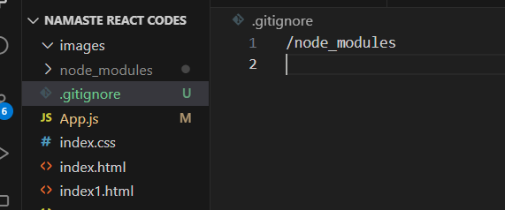
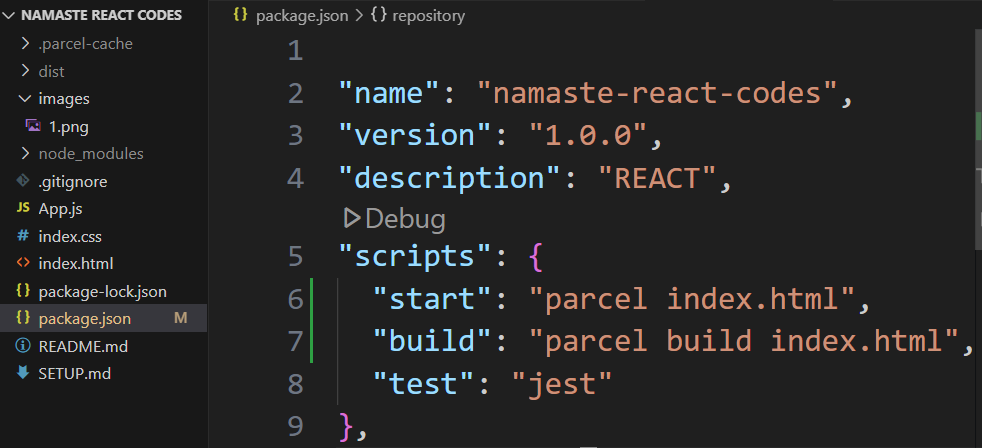

## **SETUP**

### Initialize Project
```bash
npm init
```
### Install Parcel (as a dev dependency)
```bash
npm install -D parcel
```
### .gitignore


### Igniting the App
```bash
npx parcel index.h
``` 
npx means executing the package

### Installing React
```bash
npm install react 
```
### Installing React DOM
```bash
npm install react-dom
```     

### Importing React and ReactDOM
```js
import React from "react";
import ReactDOM from "react-dom/client";
```
### Build a production-optimized bundle of our app
```bash
npx parcel build index.html
```
### Browser-list
```js
"browsersList":
  [
    "last 2 versions"
  ]
```
### Script

```bash
npm run start
npm run build 
```